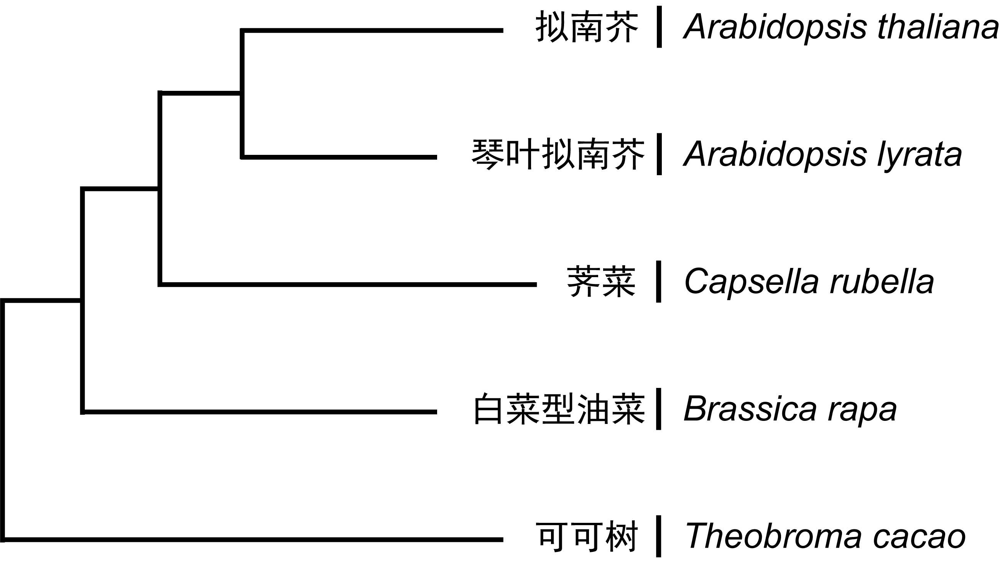

# ***MASED***

## Name Origin

**MASED** - **M**ethylation **A**nalysis of **SE**gmental **D**uplications.

## Purpose

Analyse the history and methylation of segmental duplications of *Arabidopsis thaliana*.  

* Which segments are duplicated from others?
* When did their duplication happen?
* How does the methylation of these duplications change during evolution and function acquisition？  


## Directory organization

* [`mcscanx`](mcscanx.sh): Scan multiple genomes or subgenomes to identify putative homologous chromosomal regions, then align these regions using genes as anchors.

* [`colline2yml`](colline2yml.sh): Get the collinearity regions of the genomes to YAML files.

* [`sort_sd`](sort_sd.sh): Sort the segmental duplications by different time of occurrence.

* [`find_promoter`](find_promoter.sh): Determine the promoter region of genomes.

* [`analy_meth`](analy_meth.sh): Analyse the methylation of segments.

## Preparations

### Software

Here we should firstly install [Sra-toolkit](https://trace.ncbi.nlm.nih.gov/Traces/sra/sra.cgi?view=software), [MCScanX](http://chibba.pgml.uga.edu/mcscan2/) and [Bismark](https://github.com/FelixKrueger/Bismark).

#### MCScanX

```shell script
cd MASED
unzip MCScanX.zip
cd MCScanX
make
cd ~
```

#### Bismark

```shell script
cd MASED
unzip bismark.zip
cd ~
```

#### Put into `PATH`

```shell script
echo '# Bismark' >> .bashrc
echo 'export PATH="$HOME/MASED/bismark:$PATH"' >> .bashrc
echo >> .bashrc
echo '# MCScanX' >> .bashrc
echo 'export PATH="$HOME/MASED/MCScanX:$PATH"' >> .bashrc
echo >> .bashrc
source .bashrc
```

### Data

#### Collinear

We choose 5 species to build up a time line.



To download them, you should go to JGI website with login. We also provide some data in our folder [`data/`](data/.). Others like *Theobroma cacao* and *Brassica rapa* can be downloaded from other database. 

| Specie Name | Database | Version |
| :- | :-:| -: |
| *Arabidopsis thaliana* | Araport | [V11](https://phytozome.jgi.doe.gov/pz/portal.html#!info?alias=Org_Athaliana_er) |
| *Arabidopsis lyrata* | JGI | [V2.1](https://phytozome.jgi.doe.gov/pz/portal.html#!info?alias=Org_Alyrata) |
| *Capsella rubella* | JGI | [V1.1](https://phytozome.jgi.doe.gov/pz/portal.html#!info?alias=Org_Crubella) |
| *Brassica rapa* | BRAD | [V3.0](http://brassicadb.org/brad/) |
| *Theobroma cacao* | Cocoa Genome Hub | [V2](https://cocoa-genome-hub.southgreen.fr/download) |

Take *Theobroma cacao* as an example:  
**(ATTENTION: If you want to try this for yourself, make sure you have removed the corresponding files in the folder!)**

```bash
wget https://cocoa-genome-hub.southgreen.fr/sites/cocoa-genome-hub.southgreen.fr/files/download/Theobroma_cacaoV2_annot_annoted_clean.gff3.tar.gz
tar -zvxf Theobroma_cacaoV2_annot_annoted_clean.gff3.tar.gz
mv Theobroma_cacaoV2_annot_annoted_clean.gff3 ~/MASED/data/Tcac.gff3
rm Theobroma_cacaoV2_annot_annoted_clean.gff3.tar.gz

wget https://cocoa-genome-hub.southgreen.fr/sites/cocoa-genome-hub.southgreen.fr/files/download/Theobroma_cacaoV2_annot_protein.faa.tar.gz
tar -zvxf Theobroma_cacaoV2_annot_protein.faa.tar.gz
mv Theobroma_cacaoV2_annot_protein.faa ~/MASED/data/Tcac.pep
rm Theobroma_cacaoV2_annot_protein.faa.tar.gz
```

#### BS-Seq

We choose [SRX2871291](https://www.ncbi.nlm.nih.gov/sra/SRX2871291[accn]) and [SRX2871292](https://www.ncbi.nlm.nih.gov/sra/SRX2871292[accn]) as the BS-Seq data of the Columbia wild type *Arabidopsis thaliana*.

```bash
prefetch SRR5631389
prefetch SRR5631390
prefetch SRR5631391
prefetch SRR5631392
```

The data is now in `~/ncbi/public/sra/`

```bash
mv ~/ncbi/public/sra/SRR56313* ~/MASED/data/.
cd ~/MASED/data/
fastq-dump --split-3 SRR56313*
rm SRR56313*.sra
```

## Analysis

### Pretreatment for MCScanX

```shell script
cd ~/MASED/data

awk '$3 == "gene" {print $1 "\t" $4 "\t" $5 "\t" $9 "\t" $7}' Atha.gff3 > Atha.gene.gff
awk '$3 == "gene" {print $1 "\t" $4 "\t" $5 "\t" $9 "\t" $7}' Alyr.gff3 > Alyr.gene.gff
awk '$3 == "gene" {print $1 "\t" $4 "\t" $5 "\t" $9 "\t" $7}' Crub.gff3 > Crub.gene.gff
awk '$3 == "gene" {print $1 "\t" $4 "\t" $5 "\t" $9 "\t" $7}' Brap.gff3 > Brap.gene.gff
awk '$3 == "gene" {print $1 "\t" $4 "\t" $5 "\t" $9 "\t" $7}' Tcac.gff3 > Tcac.gene.gff

perl ../gff_pep_Atha.pl Atha.gene.gff AT.gff Atha.pep > AT.pep
perl ../gff_pep_Alyr.pl Alyr.gene.gff AL.gff Alyr.pep > AL.pep
perl ../gff_pep_Crub.pl Crub.gene.gff CR.gff Crub.pep > CR.pep
perl ../gff_pep_Brap.pl Brap.gene.gff BR.gff Brap.pep > BR.pep
perl ../gff_pep_Tcac.pl Tcac.gene.gff TC.gff Tcac.pep > TC.pep

makeblastdb -in AT.pep -dbtype prot -parse_seqids -out ATdb

nohup blastp -query AL.pep -db ATdb -out AT_AL.blast -evalue 1e-10 -num_threads 4 -outfmt 6 -num_alignments 5 &
nohup blastp -query CR.pep -db ATdb -out AT_CR.blast -evalue 1e-10 -num_threads 4 -outfmt 6 -num_alignments 5 &
nohup blastp -query BR.pep -db ATdb -out AT_BR.blast -evalue 1e-10 -num_threads 4 -outfmt 6 -num_alignments 5 &
nohup blastp -query TC.pep -db ATdb -out AT_TC.blast -evalue 1e-10 -num_threads 4 -outfmt 6 -num_alignments 5 &

cat AT.gff AL.gff > AT_AL.gff
cat AT.gff CR.gff > AT_CR.gff
cat AT.gff BR.gff > AT_BR.gff
cat AT.gff TC.gff > AT_TC.gff
```

### Run MCScanX

```shell script
mcscanx -s 3 -m 2 AT_AL
mcscanx -s 3 -m 2 AT_CR
mcscanx -s 3 -m 2 AT_BR
mcscanx -s 3 -m 2 AT_TC

perl ../colline2yml.pl AT.gff AT_AT.collinearity > AT_AT.yml
perl ../colline2yml_AL.pl AT.gff AT_AL.collinearity > AT_AL.yml
perl ../colline2yml.pl AT.gff AT_CR.collinearity > AT_CR.yml
perl ../colline2yml.pl AT.gff AT_BR.collinearity > AT_BR.yml
perl ../colline2yml.pl AT.gff AT_TC.collinearity > T_TC.yml
```

### Positions

Examples in [`S288c.txt`](https://github.com/wang-q/App-RL/blob/master/t/S288c.txt)

```text
I:1-100
I(+):90-150
S288c.I(-):190-200
II:21294-22075
II:23537-24097
```


Simple rules:

* `chromosome` and `start` are required
* `species`, `strand` and `end` are optional
* `.` to separate `species` and `chromosome`
* `strand` is one of `+` and `-` and surround by round brackets
* `:` to separate names and digits
* `-` to separate `start` and `end`
* names should be alphanumeric and without spaces

```text
species.chromosome(strand):start-end
--------^^^^^^^^^^--------^^^^^^----
```

### Runlists in YAML

[App::RL](https://github.com/wang-q/App-RL)

[jrunlist](https://github.com/egateam/jrunlist)

### Blocked fasta files

Examples in [`example.fas`](https://github.com/wang-q/App-Fasops/blob/master/t/example.fas)

```text
>S288c.I(+):13267-13287|species=S288c
TCGTCAGTTGGTTGACCATTA
>YJM789.gi_151941327(-):5668-5688|species=YJM789
TCGTCAGTTGGTTGACCATTA
>RM11.gi_61385832(-):5590-5610|species=RM11
TCGTCAGTTGGTTGACCATTA
>Spar.gi_29362400(+):2477-2497|species=Spar
TCATCAGTTGGCAAACCGTTA

```


[App::Fasops](https://github.com/wang-q/App-Fasops)

### Ranges and links of ranges

[App::Rangeops](https://github.com/wang-q/App-Rangeops)

[jrange](https://github.com/egateam/jrange)

## Author

Ivan Woo &lt;wuyifanwd@hotmail.com&gt;

## Copyright and license

This is free software; you can redistribute it and/or modify it under the same terms.
